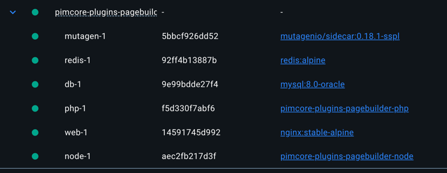
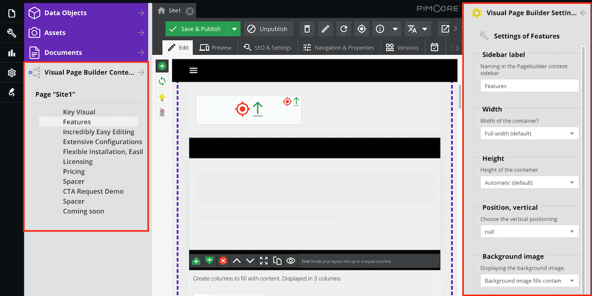

# Development and local installation

This README contains useful hints and tips regarding local installation (for developers) and general setup hints.
It is meant for technical stakeholders.

---

## Note for Non-Blackbit developers

Everytime a `bb command` is mentioned you can use mutagen-compose instead.
Please see the [config](../.blackbit/bb.yaml) for aliases you can run on your local environment.

---

## Table of contents

- Developer documentation
  - [General setup](README-dev.md#div-idgeneral-setupgeneral-setupdiv)
    - [First start](README-dev.md#div-idfirst-startfirst-startdiv-)
    - [Subsequent start](README-dev.md#div-idsubsequent-startsubsequent-startdiv-)
    - [Rebuild environment](README-dev.md#div-idrebuild-envrebuild-environmentdiv)
    - [Development](README-dev.md#div-iddevelopmentdevelopmentdiv)
    - [Building the image](README-dev.md#div-idbuild-imagebuilding-the-imagediv)
  - [Frontend builds](README-dev.md#div-idfrontend-buildsfrontend-buildsdiv)
  - [Frontend module tests](README-dev.md#div-idfrontend-testsfrontend-module-testdiv)
  - [Custom configuration](README-dev.md#div-idcustom-configurationcustom-configurationdiv)
    - [Areabricks](README-dev.md#div-idareabricksareabricksdiv)
    - [Fonts](README-dev.md#div-idfontsfontsdiv)
    - [Custom Views](README-dev.md#div-idcustom-viewscustom-viewsdiv)

---

## <div id="general-setup">General setup</div>
### <div id="first-start">First start</div> 

Run `bb install-project` to initialize the database and installation of the bundle with an empty pimcore (skeleton) instance.

### <div id="subsequent-start">Subsequent start</div> 

Use the `bb` CLI tool to run this application locally.

| Command             | Description                                                                                                                            |
|---------------------|----------------------------------------------------------------------------------------------------------------------------------------|
| `bb intall-project` | Installing and setup of the whole project. Initializes a fresh db with migrations. <br/> Run it in order to fix / refresh your setup.  |
| `bb start`          | Start the application containers. The output will contain the URL for your app.                                                        |
| `bb stop`           | Stop the application containers.                                                                                                       |
| ~~`bb db`~~         | ~~Import a database dump into the database container.~~                                                                                |
| `bb shell`          | Open a shell in the PHP container.                                                                                                     |
| `bb sa`             | Start SequelAce with a connection to the MySQL database.                                                                               |

When starting the project, you will find the following containers running: \
 \
To "enter" the container, you can use `bb shell` or `mutagen-compose exec node sh` as example for the node container.


### <div id="rebuild-env">Rebuild environment</div>

You can rebuild your environment by using `bb install-project`. This will delete the database and all local changes and then reinstall everything.

### <div id="development">Development</div>

The image contains a pristine Pimcore installation, with the current Pagebuilder bundle installed. Using `bb start` will mount your local checkout to the bundles location in the container.

Your local checkout of the bundle will be mounted to `./blackbit/visual-page-builder-bundle`. Pimcore has this installed via symlink to `vendor/blackbit/visual-page-builder-bundle`. Changes to your local files are synced via mutagen to the `bundle-code` volume.

### <div id="build-image">Building the image</div>

If you need to change code related to the Pimcore installation itself, you need to update the image or do the required changes through php code on bundle installation. You can also use `bb shell` to explore files in the container. Changes will be persisted through restarts, but wiped by `bb install-project`.

You need to use `buildx` to be able to supply your local `~/.composer/auth.json`, like the CI does.

```
# use tag from docker-compose.yaml
export tag=$(yq .services.php.image compose.yaml)
docker image rm $tag
docker buildx build --secret id=composer_auth,src=$HOME/.composer/auth.json -t $tag .
```
(note: make sure to have `yq` installed via `brew install yq` on mac)

The compose config will prefer your local image over the remote one, so you can try your changes by restarting the php container: `docker compose restart php`.

---

## <div id="frontend-builds">Frontend builds</div>

When starting the project, your container for node will be started alongside the rest. It's configured to automatically run the `yarn watch` command to automatically build your assets. \
Running `yarn dev-server` will work from within the container (shell into it) but won't run from compose setup.

**Please DO NOT use `npm` because this would create another `.lock` file that might conflict with the yarn `.lock`-file**

To install all required packages for a build run `yarn && yarn prod`.

After that you can run several build commands like:

| Command           | Description                                                                              |
|-------------------|------------------------------------------------------------------------------------------|
| `yarn dev-server` | Start a development server that runs in the background. Use this from the container only |
| `yarn dev`        | Create a development build once.                                                         |
| `yarn prod`       | Create a production build once.                                                          |
| `yarn watch`      | Start a file watcher looking for changes.                                                |

All script commands available can be found in the file `package.json` in the `scripts` section.

For BB commands (runs yarn inside the node container):

| Command            | Description                                                                                                                                                                                             |
|--------------------|---------------------------------------------------------------------------------------------------------------------------------------------------------------------------------------------------------|
| `bb fe-install  `  | Installs packages                                                                                                                                                                                       |
| `bb fe-build-dev`  | Builds dev assets inside the container and (as mounted) stored then in `src/Resources/public/build/`.                                                                                                   |
| `bb fe-build-prod` | Builds prod assets inside the container and (as mounted) stored then in `src/Resources/public/build/`. Run this after changes in assets if the new files need to be checked in (css, js, images, icons) |


### Container vs local node
This project is set up to have everything running inside docker containers. This does count for node as well. \
The `node watch` command is set up to run inside the container automatically on start. Yarn watch will only work when triggered manually inside the container. \
Please not that we don't want to support other PHP / Node / Yarn etc. versions than the ones in the docker containers provided.


## <div id="frontend-tests">Frontend module test</div>

On every instance (except for PROD) you can query test templates via:
* http://pagebuilder.docker/visual-page-builder-test/ (local docker env)

The list is generated from `.twig` files in: `tests/test-content/modules/`.

## Thumbnailing
As of now we are pushing thumbnails into the plugin's repository under `src/Resources/config/image_thumbnails/`.
Unfortunately, we cannot change the thumbnails from within Pimcore that way (because they are - as the entire plugin - mounted into the vendor folder).
How to change thumbnails:
- Run `bb thumbs-to-pimcore`. You can now change the thumbnails within Pimcore. \
  To persist any changes you have to copy the thumbnails' yaml files back into the plugin itself.
- run `docker cp $(docker compose ps -q php):/var/www/html/var/config/image_thumbnails/ ./src/Resources/config` \
  (Sorry, no bb command for this yet)
- for video thumbnails run `docker cp $(docker compose ps -q php):/var/www/html/var/config/video_thumbnails/ ./src/Resources/config`

## <div id="custom-configuration">Custom configuration</div>
### <div id="areabricks">Areabricks</div>
To add custom bricks to the page builder, you have to create a custom symfony configuration.
Best practice would be in `config/packages/blackbit_visual_page_builder.yaml`.

You can add custom bricks from your own bundle / project or from third party bundles in general (the id must match the one in the bundle).
```yaml
blackbit_visual_page_builder:
    areabricks:
        templates:
            # Highest level where only container do live <-- you shouldn't want to change anything here
            default:
                - { id: 'custom-brick-1', group: 'Content' }
            # Nearly all the regular modules inside containers
            modules:
                - { id: 'custom-brick-2', group: 'Special' }
            # Modules which can be nested inside other modules (such as container, grids..)
            nestable:
                - { id: 'custom-brick-3', group: 'Structure' }
            # Snippet modules for special use cases like navigation and footer
            snippet:
                - { id: 'custom-brick-4', group: 'Communication' }
```
The `id` must exist in any pimcore bundle and has to be registered before in Pimcore. Otherwise, it will be skipped as a non-existent brick.

With the following groups in Pimcore admin:
- `Content`
- `Structure`
- `Communication`
- `Special`
- `Layout` (only for snippets)

In order to make twig find your custom bricks and their templates you might have to add a little twig config:
```yaml
twig:
    paths:
        '%kernel.project_dir%/templates/areas': areas
```
and then use in the brick's controller:
```php
use Blackbit\VisualPageBuilderBundle\Document\AbstractAreabrick;
use Pimcore\Extension\Document\Areabrick\Attribute\AsAreabrick;

#[AsAreabrick(id: 'test')]
class Test extends AbstractAreabrick
{
    ...
    
    final public function getTemplate(): ?string
    {
        return '@areas/Test/view.html.twig';
    }
    
    ...
}
```

### <div id="fonts">Fonts</div>

### <div id="custom-views">Custom Views</div>
The Blackbit Visual Page Builder provides some custom views within the Pimcore Admin Interface,<br>
which simplifies the handling of the Visual Page Builder documents. 



In order for these custom views to be available in Perspectives, some settings must be made.

If perspectives have been configured for the Pimcore Admin Interface (see https://docs.pimcore.com/platform/next/Pimcore/Tools_and_Features/Perspectives/),<br>
```yaml
# EXAMPLE var/config/perspectives/perspectives.yaml

pimcore:
    perspectives:
        definitions:
            content_marketing: # <-- this is the perspective key
                elementTree:
                    -
                        type: documents
                        position: left
                        expanded: false
                        hidden: false
                        sort: 2
```

the keys of the perspectives must be added as an entry in the following configuration of the Blackbit Visual Page Builder:

```yaml
# EXAMPLE config/packages/blackbit_visual_page_builder.yaml

blackbit_visual_page_builder:
    custom_views:
        enabledForPerspectives:
            - content_marketing # <-- this is the perspective key

```
