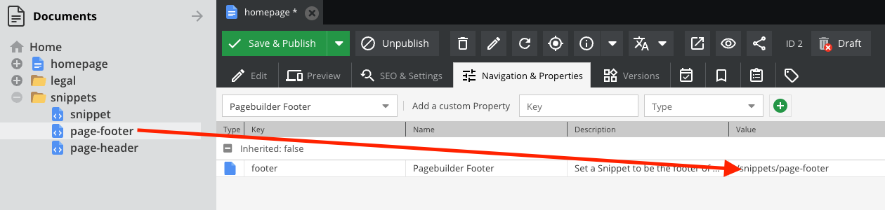

# Installation and usage
This README explains how to install this bundle into an already running pimcore installation and shows some of the use cases.


## Installation
### Prerequisites
Pimcore needs to have the following Plugins installed in the classic admin interface:
- PimcoreTinymceBundle
- PimcoreApplicationLoggerBundle
  See [pimcore installation site](https://pimcore.com/docs/platform/Pimcore/Getting_Started/Advanced_Installation_Topics/#installing-bundles) for details.

Furthermore, we need Pimcore 11 and PHP >= 8.1

Usually only install via composer is needed + the embedding in bundles (or kernel file).

Composer: \
`composer require blackbit/visual-page-builder-bundle`

Activating (add to bundles.php): \

```php
...
    Pimcore\Bundle\ApplicationLoggerBundle\PimcoreApplicationLoggerBundle::class => ['all' => true],
    Pimcore\Bundle\TinymceBundle\PimcoreTinymceBundle::class => ['all' => true],
    Pimcore\Bundle\UuidBundle\PimcoreUuidBundle::class => ['all' => true],
    Blackbit\VisualPageBuilderBundle\BlackbitVisualPageBuilderBundle::class => ['all' => true],
...
```
(We do require the logger + uuid + tinymce bundles as well)


Migration: \
`bin/console doctrine:migrations:migrate`

## Configuration
### Webpack
If your project already uses webpack encore, you can add the following to your `webpack.yaml` in the project's config:

```yaml
webpack_encore:
    # If multiple builds are defined (as shown below), you can disable the default build:
    output_path: false

    builds:
        # This is your default build
        _default: '%kernel.project_dir%/public/build'
        # This is the build for the pagebuilder which must be specified.
        # Otherwise the twig templates won't find the assets when using the entry points
        pagebuilder: '%kernel.project_dir%/public/bundles/blackbitvisualpagebuilder/build'
```

You have set the output path to false explicitly.

### Bundle Configuration
The configuration `blackbit_pagebuilder` consists of various sections that influence the functionality of the PageBuilder.

#### Cache settings
```yaml
blackbit_visual_page_builder:
    cache:
        css_variables:
            enabled: false
```
css_variables.enabled: Controls whether CSS variables should be cached.
- false: Deactivates caching.
- true: Enables caching.

#### Font mapping

The definitions.mapping section defines available fonts that can be used in the PageBuilder. These settings are used to define the mapping for
the fonts and font variants that can be configured in the Pimcore Admin Interface. This is particularly important if new fonts and variants are to be added.

```yaml
blackbit_pagebuilder:
    definitions:
        mapping:
            fonts:
                -   name: 'Roboto'
                    fontFamily: 'Roboto'
                    fontType: 'sans-serif'
```
fonts: A list of fonts that are available for designing the pages in PageBuilder.
- name: Display name of the font.
- fontFamily: The technical name of the font for use in CSS.
- fontType: The type of font (sans-serif or serif).

Font examples in the configuration:
- Roboto (Sans-Serif)
- Open Sans (Sans-Serif)
- Lora (Serif)
- Playfair Display (Serif)

#### Font variants
```yaml
blackbit_pagebuilder:
    definitions:
        mapping:
            variants:
                - normal
                - light
```
variants: Defines the available font variants for selection in the PageBuilder.
- normal: Standard weight of the font.
- light: A lighter variant of the font.

#### Usage
This configuration file allows administrators to provide fonts and their variants for the PageBuilder in the admin interface.<br>
Changes to the configuration should be made with caution and tested after adjustments.

## Features
### Custom CSS
The Blackbit Visual Page Builder comes with built-in styles. But with the feature of Custom CSS, you can simply upload a CSS File into <br>
the Pimcore Admin UI as usual and assign it as a custom CSS for your specific site setting within the Blackbit Visual Page Builder Settings.


With the button "Open", you have the possibility to open the file in the Pimcore Admin UI. The file will be opened in a new tab.<br>
And you can start editing the CSS file directly in the Pimcore Admin UI. This is a great feature for quick changes and adjustments.<br> 
Also, the live pre-validation of the CSS file is a great feature.


While saving your Custom CSS file, a validation will appear. This is a great feature to prevent errors in the CSS file. <br>
This validation only appears if you have assigned the CSS file to a site configuration in the Blackbit Visual Page Builder Settings.


#### Insert Custom CSS into Layout
You can insert your Custom CSS into the layout of the Blackbit Visual Page Builder by using the provided Twig function.
```twig
{{ visual_page_builder_entry_custom_css_tags() }}
```
This function will generate a separate file including a hash for the file name, because the file will be cached.

---

## Usage

### Creating a Navigation

To create a new `Page header` snippet for your site (including the primary navigation) right click on any existing node in the document tree and select "Add snippet > VisualPageBuilder > Page Header (Navigation)" and give it a unique name.
To display this snippet in your layout, open the `root document` (usually the homepage), open the tab `Navigation & Properties` and select `Pagebuilder header` from the dropdown menu `Predefined Properties`.


Drag in your newly created header snippet to automatically generate a header for your site.


Now, change back to the `Edit` tab and fill out the actual content. 

### Creating a Footer

To create a new `Page footer` snippet for your site right click on any existing node in the document tree and select "Add snippet > VisualPageBuilder > Page Footer" and give it a unique name.
To display this snippet in your layout, open the `root document` (usually the homepage), open the tab `Navigation & Properties` and select `Pagebuilder footer` from the dropdown menu `Predefined Properties`.


Drag in your newly created footer snippet to automatically generate a footer for your site.



Now, change back to the `Edit` tab and start building your footer.
